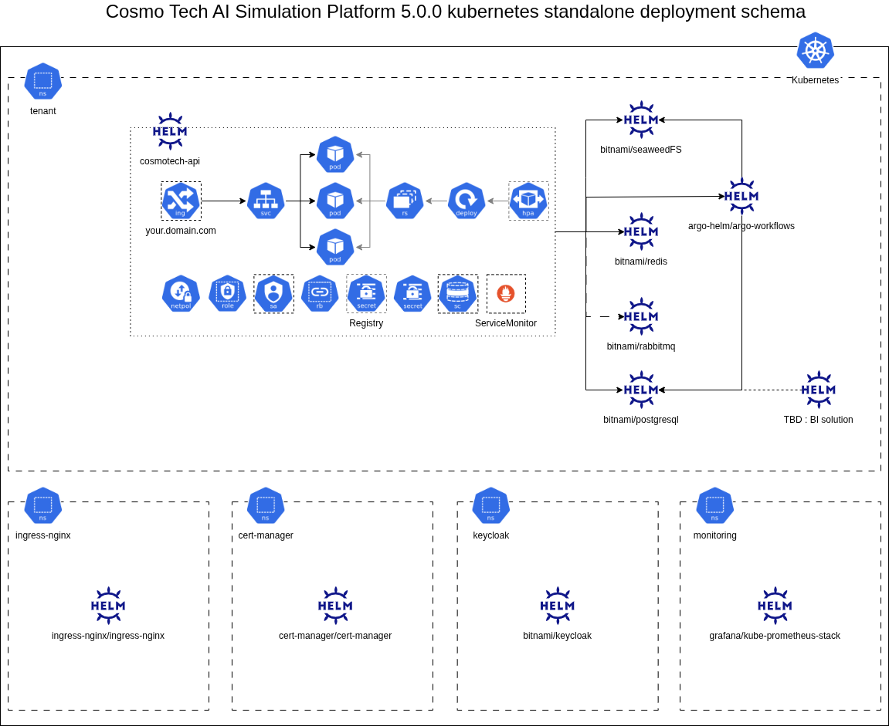

# cosmotech-api

  

Cosmo Tech Platform API


# Kubernetes deployment schema


# How to Deploy the Cosmo Tech Platform on a Kubernetes Cluster

This guide provides instructions to deploy the Cosmo Tech platform on a Kubernetes cluster using Helm charts. The deployment includes several services in the following order: PostgreSQL, Argo Workflows, RabbitMQ, Redis, and finally, the Cosmo Tech API.

## Prerequisites

Before starting the deployment, ensure you have the following:
- A Kubernetes cluster
- Helm installed
- Access to the Kubernetes cluster (e.g., `kubectl` configured)
- Required environment variables set up
- A Kubernetes namespace for this deployment

## 1. Deploy PostgreSQL

Deploy PostgreSQL using the Bitnami Helm chart:

```bash
helm install --namespace ${NAMESPACE} ${POSTGRES_RELEASE_NAME} bitnami/postgresql --version "11.6.12" --values - <<EOF
image:
  debug: true
auth:
  enablePostgresUser: true
  database: postgres
  existingSecret: ${POSTGRESQL_SECRET_NAME}
  secretKeys:
    adminPasswordKey: postgres-password
primary:
  podLabels:
    "networking/traffic-allowed": "yes"
  persistence:
    enabled: true
    size: ${PERSISTENCE_SIZE}
    existingClaim: ${PVC_NAME}
  initdb:
    user: postgres
    password: ${POSTGRESQL_PASSWORD}
    scriptsSecret: ${POSTGRESQL_INITDB_SECRET}
resources:
  requests:
    memory: "64Mi"
    cpu: "250m"
  limits:
    memory: "256Mi"
    cpu: "1"
metrics:
  enabled: true
  serviceMonitor:
    enabled: true
    namespace: ${MONITORING_NAMESPACE}
    interval: 30s
    scrapeTimeout: 10s
EOF
```

## 2. Deploy SeaweedFS

Deploy SeaweedFS using the SeaweedFS Helm chart:

```bash
helm repo add bitnami https://charts.bitnami.com/bitnami
helm install --namespace ${NAMESPACE} ${SEAWEED_RELEASE_NAME} bitnami/seaweedfs --version 4.8.7 --values - <<EOF
master:
  persistence:
    existingClaim: "${SEAWEEDFS_MASTER_PVC_EXISTING_NAME}"
    size: "${SEAWEEDFS_MASTER_PVC_SIZE}"
    accessModes:
    - ${SEAWEEDFS_PVC_ACCESSMODE}
    storageClass: "${SEAWEEDFS_STORAGECLASS_NAME}"
  nodeSelector:
    cosmotech.com/tier: "services"
  tolerations:
    - key: "vendor"
      operator: "Equal"
      value: "cosmotech"
      effect: "NoSchedule"
mariadb:
  enabled: false
externalDatabase:
  enabled: true
  store: postgresql
  host: "${POSTGRESQL_HOST}"
  port: ${POSTGRESQL_PORT}
  database: "${POSTGRESQL_DATABASE}"
  user: "${POSTGRESQL_USERNAME}"
  existingSecret: "${POSTGRESQL_SECRET}"
volume:
  dataVolumes:
  - name: data-0
    mountPath: /data-0
    maxVolumes: 0
    persistence:
      existingClaim: "${SEAWEEDFS_VOLUME_PVC_EXISTING_NAME}"
      size: "${SEAWEEDFS_VOLUME_PVC_SIZE}"
      accessModes:
      - ${SEAWEEDFS_PVC_ACCESSMODE}
      storageClass: "${SEAWEEDFS_STORAGECLASS_NAME}"
  nodeSelector:
    cosmotech.com/tier: "db"
  tolerations:
    - key: "vendor"
      operator: "Equal"
      value: "cosmotech"
      effect: "NoSchedule"
filer:
  nodeSelector:
    cosmotech.com/tier: "services"
  resourcesPreset: medium
  tolerations:
    - key: "vendor"
      operator: "Equal"
      value: "cosmotech"
      effect: "NoSchedule"
s3:
  enabled: true
  nodeSelector:
    cosmotech.com/tier: "services"
  tolerations:
    - key: "vendor"
      operator: "Equal"
      value: "cosmotech"
      effect: "NoSchedule"
  containerPorts:
    http: 9000
  auth:
    enabled: true
    existingSecret: "${S3_AUTH_SECRET}"
  allowEmptyFolder: false
extraDeploy:
  # There are no value entries to setup initial s3-buckets/http-folders
  # So we deploy a Job as a post-{install,upgrade} to create them through the http filer api
  - |
    apiVersion: batch/v1
    kind: Job
    metadata:
      name: {{ printf "%s-init-buckets" (include "common.names.fullname" .) | trunc 63 | trimSuffix "-" }}
      namespace: {{ include "common.names.namespace" . | quote }}
      labels:
        {{- include "common.labels.standard" ( dict "customLabels" .Values.commonLabels "context" $ ) | nindent 4 }}
      annotations:
        helm.sh/hook: post-install,post-upgrade
        helm.sh/hook-delete-policy: before-hook-creation,hook-succeeded
    spec:
      template:
        metadata:
          labels:
            {{- include "common.labels.standard" ( dict "customLabels" .Values.commonLabels "context" $ ) | nindent 8 }}
        spec:
          restartPolicy: OnFailure
          {{- if .Values.filer.podSecurityContext.enabled }}
          securityContext:
            {{- include "common.compatibility.renderSecurityContext" (dict "secContext" .Values.filer.podSecurityContext "context" $) | nindent 8 }}
          {{- end }}
          nodeSelector:
            cosmotech.com/tier: services
          tolerations:
          - key: "vendor"
            operator: "Equal"
            value: "cosmotech"
            effect: "NoSchedule"
          containers:
            - name: init-buckets
              image: alpine
              {{- if .Values.filer.containerSecurityContext.enabled }}
              securityContext:
                {{- include "common.compatibility.renderSecurityContext" (dict "secContext" .Values.filer.containerSecurityContext "context" $) | nindent 12 }}
              {{- end }}
              command:
                - /bin/sh
              args:
                - -exc
                - |
                  %{~ for bucket in S3_INIT_BUCKETS ~}
                  if ! `wget --quiet -O /dev/null --spider ${FILER_ENDPOINT}/buckets/${bucket}/`
                  then
                    wget --quiet -O /dev/null --post-data= --header "Content-Type:" ${FILER_ENDPOINT}/buckets/${bucket}/
                  fi
                  %{~ endfor ~}
EOF
```

## 3. Deploy Argo Workflows

Deploy Argo Workflows using the Argo Helm chart:

```bash
helm repo add bitnami https://charts.bitnami.com/bitnami
helm install --namespace ${NAMESPACE} ${ARGO_RELEASE_NAME} bitnami/argo-workflows --version "12.0.0" --values - <<EOF
server:
  clusterWorkflowTemplates:
    enabled: false
  serviceAccount:
    automountServiceAccountToken: true
  nodeSelector:
    "cosmotech.com/tier": "services"
  tolerations:
    - key: "vendor"
      operator: "Equal"
      value: "cosmotech"
      effect: "NoSchedule"
  service:
    ports:
      http: 2746

controller:
  persistence:
    archive:
      enabled: true
  config: |
    {{- if .Values.controller.instanceID.enabled }}
    {{- if .Values.controller.instanceID.useReleaseName }}
    instanceID: {{ .Release.Name }}
    {{- else }}
    instanceID: {{ .Values.controller.instanceID.explicitID }}
    {{- end }}
    {{- end }}
    parallelism:
    namespaceParallelism:
    {{- if or .Values.executor.resources .Values.executor.extraEnvVars .Values.executor.containerSecurityContext }}
    executor:
      {{- if .Values.executor.resources }}
      resources: {{- include "common.tplvalues.render" (dict "value" .Values.executor.resources "context" $) | nindent 4 }}
      {{- else if ne .Values.executor.resourcesPreset "none" }}
      resources: {{- include "common.resources.preset" (dict "type" .Values.executor.resourcesPreset) | nindent 4 }}
      {{- end }}
      {{- if .Values.executor.extraEnvVars }}
      env: {{- include "common.tplvalues.render" (dict "value" .Values.executor.extraEnvVars "context" $) | nindent 4 }}
      {{- end }}
      {{- if .Values.executor.containerSecurityContext }}
      securityContext: {{- omit .Values.executor.containerSecurityContext "enabled" | toYaml | nindent 4 }}
      {{- end }}
    {{- end }}
    artifactRepository:
      archiveLogs: true
      s3:
        endpoint: "${S3_ENDPOINT}"
        bucket: "${S3_BUCKET_NAME}"
        insecure: true
        accessKeySecret:
          name: "${S3_CREDENTIALS_SECRET}"
          key: "${S3_USERNAME_KEY}"
        secretKeySecret:
          name: "${S3_CREDENTIALS_SECRET}"
          key: "${S3_PASSWORD_KEY}"
    {{- if .Values.controller.metrics.enabled }}
    metricsConfig: {{- include "common.tplvalues.render" (dict "value" .Values.controller.metrics "context" $) | nindent 2 }}
    {{- end }}
    {{- if .Values.controller.telemetry.enabled }}
    telemetryConfig: {{- include "common.tplvalues.render" (dict "value" .Values.controller.telemetry "context" $) | nindent 2 }}
    {{- end }}
    {{- if (include "argo-workflows.controller.persistence.enabled" .) }}
    persistence:
      connectionPool:
        maxIdleConns: 100
        maxOpenConns: 0
      nodeStatusOffLoad: false
      archive: {{ include "common.tplvalues.render" (dict "value" .Values.controller.persistence.archive.enabled "context" $) }}
      {{- if or .Values.postgresql.enabled (and .Values.externalDatabase.enabled (eq .Values.externalDatabase.type "postgresql")) }}
      postgresql:
      {{- else if or .Values.mysql.enabled (and .Values.externalDatabase.enabled (eq .Values.externalDatabase.type "mysql")) }}
      mysql:
      {{- end }}
        host: {{ include "argo-workflows.controller.database.host" . }}
        port: {{ include "argo-workflows.controller.database.port" . }}
        database: {{ include "argo-workflows.controller.database" . }}
        tableName: argo_workflows
        userNameSecret:
          name: {{ include "argo-workflows.controller.database.username.secret" . }}
          key: username
        passwordSecret:
          name: {{ include "argo-workflows.controller.database.password.secret" . }}
          key: {{ include "argo-workflows.controller.database.password.secret.key" . }}
    {{- end }}
    {{- if .Values.controller.workflowDefaults }}
    workflowDefaults: {{- include "common.tplvalues.render" (dict "value" .Values.controller.workflowDefaults "context" $) | nindent 2 }}
    {{- end }}
    {{- if and .Values.server.auth.enabled .Values.server.auth.sso.enabled }}
    sso: {{- include "common.tplvalues.render" (dict "value" .Values.server.auth.sso.config "context" $) | nindent 2 }}
    {{- end }}
  clusterWorkflowTemplates:
    enabled: false
  metrics:
    enabled: true
    serviceMonitor:
      enabled: true
  workflowDefaults:
    spec:
      securityContext:
        runAsGroup: 1001
        runAsNonRoot: true
        runAsUser: 1001
        fsGroup: 1001
        fsGroupChangePolicy: Always
        seLinuxOptions: {}
        seccompProfile:
          type: RuntimeDefault
      # make sure workflows do not run forever. Default limit set is 7 days (604800 seconds)
      activeDeadlineSeconds: 604800
      ttlStrategy:
        # keep workflows that succeeded for 1d (86400 seconds).
        # We can still view them since they are archived.
        secondsAfterSuccess: 86400
        # keep workflows that have completed (either successfully or not) for 3d (259200 seconds).
        # We can still view them since they are archived.
        secondsAfterCompletion: 259200
      podGC:
        # Delete pods when workflows are successful.
        # We can still access their logs and artifacts since they are archived.
        # One of "OnPodCompletion", "OnPodSuccess", "OnWorkflowCompletion", "OnWorkflowSuccess"
        strategy: OnWorkflowSuccess
      volumeClaimGC:
        # Delete PVCs when workflows are done. However, due to Kubernetes PVC Protection,
        # such PVCs will just be marked as Terminating, until no pod is using them.
        # Pod deletion (either via the Pod GC strategy or the TTL strategy) will allow to free up
        # attached PVCs.
        # One of "OnWorkflowCompletion", "OnWorkflowSuccess"
        strategy: OnWorkflowCompletion
  serviceAccount:
    automountServiceAccountToken: true
  nodeSelector:
    "cosmotech.com/tier": "services"
  tolerations:
    - key: "vendor"
      operator: "Equal"
      value: "cosmotech"
      effect: "NoSchedule"

executor:
  resources:
    requests:
      cpu: 2
      memory: 512Mi
    limits:
      cpu: 3
      memory: 1024Mi
  extraEnvVars:
    - name: RESOURCE_STATE_CHECK_INTERVAL
      value: 1s
    - name: WAIT_CONTAINER_STATUS_CHECK_INTERVAL
      value: 1s

ingress:
  enabled: false

workflows:
  serviceAccount:
    name: ${ARGO_SERVICE_ACCOUNT}
    automountServiceAccountToken: true

postgresql:
  enabled: false

externalDatabase:
  enabled: true
  type: "postgresql"
  host: "${POSTGRES_RELEASE_NAME}"
  port: "5432"
  username: ${ARGO_POSTGRESQL_USER}
  password: ""
  database: ${ARGO_DATABASE}
  existingSecret: ${ARGO_POSTGRESQL_SECRET_NAME}
EOF
```

## 4. Deploy RabbitMQ

Deploy RabbitMQ using the Bitnami Helm chart:

```bash
helm install --namespace ${NAMESPACE} ${RABBITMQ_RELEASE_NAME} bitnami/rabbitmq --version "13.0.3" --values - <<EOF
auth:
  existingPasswordSecret: ${INSTANCE_NAME}-secret
  existingSecretPasswordKey: admin-password
extraPlugins: "rabbitmq_amqp1_0 rabbitmq_prometheus"
extraSecrets:
  ${INSTANCE_NAME}-load-definition:
    load_definition.json: |
      {
        "users": [
          {
            "name": "admin",
            "password": "${ADMIN_PASSWORD}",
            "tags": "administrator"
          },
          {
            "name": "${LISTENER_USERNAME}",
            "password": "${LISTENER_PASSWORD}",
            "tags": ""
          },
          {
            "name": "${SENDER_USERNAME}",
            "password": "${SENDER_PASSWORD}",
            "tags": ""
          }
        ],
        "vhosts": [
          {
            "name": "/"
          }
        ],
        "permissions": [
          {
            "user": "admin",
            "vhost": "/",
            "configure": ".*",
            "write": ".*",
            "read": ".*"
          },
          {
            "user": "${LISTENER_USERNAME}",
            "vhost": "/",
            "configure": ".*",
            "write": ".*",
            "read": ".*"
          },
          {
            "user": "${SENDER_USERNAME}",
            "vhost": "/",
            "configure": ".*",
            "write": ".*",
            "read": ".*"
          }
        ]
      }
loadDefinition:
  enabled: true
  existingSecret: ${INSTANCE_NAME}-load-definition
extraConfiguration: |
  load_definitions = /app/load_definition.json
persistence:
  enabled: true
  size: ${PERSISTENCE_SIZE}
  existingClaim: ${PVC_NAME}
metrics:
  enabled: true
  serviceMonitor:
    enabled: true
    namespace: ${MONITORING_NAMESPACE}
    interval: 30s
    scrapeTimeout: 10s
EOF
```

## 5. Deploy Redis

Deploy Redis using the Bitnami Helm chart:

```bash
helm install --namespace ${NAMESPACE} ${REDIS_RELEASE_NAME} bitnami/redis --version "17.8.0" --values - <<EOF
auth:
  password: ${REDIS_PASSWORD}
serviceBindings: 
  enabled: true
image:
  registry: ghcr.io
  repository: cosmo-tech/cosmotech-redis
  tag: ${VERSION_REDIS_COSMOTECH}
volumePermissions:
  enabled: true
  image:
    registry: docker.io
    repository: bitnami/os-shell
    tag: latest
    pullPolicy: IfNotPresent
sysctl:
  image:
    registry: docker.io
    repository: bitnami/os-shell
    tag: latest
    pullPolicy: IfNotPresent
master:
  persistence:
    enabled: true
    size: ${REDIS_DISK_SIZE}
    existingClaim: ${REDIS_MASTER_NAME_PVC}
  podLabels:
    networking/traffic-allowed: "yes"
  resources:
    requests:
      cpu: 500m
      memory: 4Gi
    limits:
      cpu: 1000m
      memory: 4Gi
replica:
  replicaCount: 1
  podLabels:
    networking/traffic-allowed: "yes"
  persistence:
    enabled: true
    size: ${REDIS_DISK_SIZE}
    existingClaim: ${REDIS_REPLICA_NAME_PVC}
  resources:
    requests:
      cpu: 500m
      memory: 4Gi
    limits:
      cpu: 1000m
      memory: 4Gi
commonConfiguration: |-
  loadmodule /opt/bitnami/redis/modules/redistimeseries.so DUPLICATE_POLICY LAST
  loadmodule /opt/bitnami/redis/modules/rejson.so
  loadmodule /opt/bitnami/redis/modules/redisearch.so
EOF
```

## 6. Deploy keycloak

Create a file for the secrets

```bash
keycloak_admin_user=<keycloak_admin_user>
keycloak_admin_password=<keycloak_admin_password>
keycloak_postgres_user=<postgres_user>
keycloak_postgres_password=<postgres_user_password>
keycloak_postgres_admin_password=<postgres_admin_password>
```

Create a kubernetes secret from the contents of the created file

```bash
kubectl create secret generic keycloak_config --namespace <namespace> --from-env-file=<secret_env_file>
```

Install the PostgreSQL helm chart

```bash
helm install postgresql bitnami/postgresql --namespace <namespace> --version 15.5.1 --values - <<EOF
global:
  postgresql:
    auth:
      database: "keycloak_db"
      username: ${POSTGRES_USER}
      existingSecret: ${SECRET}
      secretKeys:
        userPasswordKey: ${POSTGRES_PASSWORD_SECRET_KEY}
        adminPasswordKey: ${POSTGRES_ADMIN_PASSWORD_SECRET_KEY}
primary:
  persistence:
    enabled: true
    storageClass: ${STORAGE_CLASS}
EOF

# Install Keycloak helm chart
helm install keycloak bitnami/keycloak --namespace <namespace> --version 21.3.1 --values - <<EOF
proxy: "edge"
httpRelativePath: "/keycloak/"
auth:
  existingSecret: ${SECRET}
  adminUser: ${ADMIN_USER}
  passwordSecretKey: ${ADMIN_PASSWORD_SECRET_KEY}
ingress:
  enabled: true
  servicePort: "http"
  hostname: ${INGRESS_HOSTNAME}
  annotations:
    kubernetes.io/ingress.class: nginx
    nginx.ingress.kubernetes.io/proxy-body-size: "0"
    nginx.ingress.kubernetes.io/proxy-connect-timeout: "30"
    nginx.ingress.kubernetes.io/proxy-read-timeout: "30"
    nginx.ingress.kubernetes.io/proxy-send-timeout: "30"
    nginx.org/client-max-body-size: "0"
postgresql:
  enabled: false
externalDatabase:
  database: "keycloak_db"
  host: "keycloak-postgresql.${NAMESPACE}.svc.cluster.local"
  user: ${POSTGRES_USER}
  existingSecret: ${SECRET}
  existingSecretPasswordKey: ${POSTGRES_PASSWORD_SECRET_KEY}
EOF
```

## 7. Deploy Cosmo Tech API


### Step 1: Add Helm Repository

If you haven't already added the Helm repository for Cosmo Tech API, execute the following command:

```bash
helm repo add cosmotech https://cosmo-tech.github.io/helm-charts
helm repo update
```

### Step 2: Deploy Cosmo Tech API

Deploy the Cosmo Tech API using the Helm chart with the specified values:

```bash
helm install ${RELEASE_NAME} cosmotech/cosmotech-api --namespace ${NAMESPACE} --version "5.0.0-beta1" --values - <<EOF
replicaCount: ${API_REPLICAS}
api:
  version: ${API_VERSION_PATH}
  multiTenant: ${MULTI_TENANT}
  servletContextPath: /cosmotech-api
image:
  repository: ghcr.io/cosmo-tech/cosmotech-api
  tag: ${API_VERSION}
argo:
  imageCredentials:
    password: ${ACR_LOGIN_PASSWORD}
    registry: ${ACR_LOGIN_SERVER}
    username: ${ACR_LOGIN_USERNAME}
config:
  api:
    serviceMonitor:
      enabled: ${MONITORING_ENABLED}
      namespace: ${MONITORING_NAMESPACE}
  logging:
    level:
      com.cosmotech: DEBUG
      web: WARN
      org.springframework: WARN
      com.redis: WARN
  server:
    error:
      include-stacktrace: always
  csm:
    platform:
      s3:
        endpointUrl: http://seaweedfs-{NAMESPACE}.{NAMESPACE}.svc.cluster.local:9000
        bucketName: cosmotech-api
        accessKeyId: ${S3_ACCESS_KEY}
        secretAccessKey: ${S3_ACCESS_SECRET}
        region: ${S3_REGION}
      containerRegistry:
        # Add your container registry configuration here
      identityProvider:
        code: keycloak
        authorizationUrl: ${AUTHORIZATION_URL}
        tokenUrl: ${TOKEN_URL}
        defaultScopes:
          openid: ${OPENID_SCOPE}
        containerScopes:
          changeme: ${CONTAINER_SCOPE}
        serverBaseUrl: ${SERVER_BASE_URL}
        audience: ${AUDIENCE}
        identity:
          clientId: ${CLIENT_ID}
          clientSecret: ${CLIENT_SECRET}
          tenantId: ${TENANT_ID}
      namespace: ${NAMESPACE}
      argo:
        base-uri: "http://${ARGO_RELEASE_NAME}-argo-workflows-server.${NAMESPACE}.svc.cluster.local:2746"
        workflows:
          namespace: ${NAMESPACE}
          service-account-name: ${ARGO_SERVICE_ACCOUNT}
      authorization:
        allowedApiKeyConsumers: ${ALLOWED_API_KEY_CONSUMERS}
        allowed-tenants: ${TENANT_ID}
      internalResultServices:
        enabled: ${USE_INTERNAL_RESULT_SERVICES}
        storage:
          host: "${POSTGRESQL_RELEASE_NAME}-postgresql.${NAMESPACE}.svc.cluster.local"
          port: 5432
          reader:
            username: ${POSTGRESQL_READER_USERNAME}
            password: ${POSTGRESQL_READER_PASSWORD}
          writer:
            username: ${POSTGRESQL_WRITER_USERNAME}
            password: ${POSTGRESQL_WRITER_PASSWORD}
          admin:
            username: ${POSTGRESQL_ADMIN_USERNAME}
            password: ${POSTGRESQL_ADMIN_PASSWORD}
        eventBus:
          host: "${RABBITMQ_RELEASE_NAME}.${NAMESPACE}.svc.cluster.local"
          port: 5672
          listener:
            username: ${RABBITMQ_LISTENER_USERNAME}
            password: ${RABBITMQ_LISTENER_PASSWORD}
          sender:
            username: ${RABBITMQ_SENDER_USERNAME}
            password: ${RABBITMQ_SENDER_PASSWORD}
      twincache:
        host: "cosmotechredis-${NAMESPACE}-master.${NAMESPACE}.svc.cluster.local"
        port: ${REDIS_PORT}
        username: "default"
        password: ${REDIS_PASSWORD}
ingress:
  enabled: ${COSMOTECH_API_INGRESS_ENABLED}
  annotations:
    cert-manager.io/cluster-issuer: ${TLS_SECRET_NAME}
    kubernetes.io/ingress.class: nginx
    nginx.ingress.kubernetes.io/proxy-body-size: "0"
    nginx.ingress.kubernetes.io/proxy-connect-timeout: "30"
    nginx.ingress.kubernetes.io/proxy-read-timeout: "30"
    nginx.ingress.kubernetes.io/proxy-send-timeout: "30"
    nginx.org/client-max-body-size: "0"
  hosts:
    - host: ${COSMOTECH_API_DNS_NAME}
  tls:
    - secretName: ${TLS_SECRET_NAME}
      hosts: ["${COSMOTECH_API_DNS_NAME}"]
resources:
  limits:
    memory: 2048Mi
  requests:
    memory: 1024Mi
networkPolicy:
  enabled: true
persistence:
  # -- Enable the data storage persistence
  enabled: true
  # -- PVC storage request for the data volume
  size: 8Gi
  # -- PVC storage class for the data volume, currently requires a ReadWriteMany capability
  storageClass: ""
EOF
```

### Step 3: Verify Deployment

Check the deployment status using:

```bash
kubectl get pods -n ${NAMESPACE}
```

### Step 4: Access Cosmo Tech API

Once deployed, access the Cosmo Tech API using the configured ingress hostname (${COSMOTECH_API_DNS_NAME}).

### Optional: Configure TLS client access to Redis / Keycloak / RabbitMQ
If you want to access a Redis / Keycloak / RabbitMQ with SSL / TLS you need to configure the following values:
``` yaml
api:
  tlsTruststore:
    enabled: true
```
#### Define a custom root Certificate Authority
If you secured your Redis with a PKI infrastructure and your own root Certificate Authority and certificates chain, you need to define this certificates to the Cosmo Tech API.

You still need to define the previous settings for twincache.

You can define this root certificate either with CRT/PEM format or with a Java Key Store / JKS.

To do so you need first to create a kubernetes secret with your certificate file, then you must to define the values in api.tlsTruststore.

##### Example: Redis / Keycloak / RabbitMQ TLS with PEM custom root CA
Create a kubernetes secret:
``` bash
kubectl -n mynamespace create secret generic cosmo-certificates-tls-secret --from-file=./rootCA.crt
```
And configure the helm chart values:
``` yaml
api:
  tlsTruststore:
    enabled: true
    secretName: cosmo-certificates-tls-secret
    secretKey: rootCA.crt
    fileName: rootCA.crt
    type: pem
```

##### Example: Redis / Keycloak / RabbitMQ TLS with JKS custom root CA
Create a kubernetes secret:
``` bash
kubectl -n mynamespace create secret generic cosmo-jks-secret --from-file=./rootCA.jks
```
And configure the helm chart values:
``` yaml
api:
  tlsTruststore:
    enabled: true
    secretName: cosmo-jks-secret
    secretKey: rootCA.jks
    fileName: rootCA.jks
    type: jks
    jksPassword: mypassword
```

### Optional: Disable TLS client access to Redis 

To do so, modify the Cosmo Tech API values file by adding this part :
``` yaml
config:
  csm:
    platform:
      twincache:
        tls:
          enabled: false
```

### Optional: Disable TLS client access to Keycloak

To do so, modify the Cosmo Tech API values file by adding this part :
``` yaml
config:
  csm:
    platform:
      identityProvider:
        tls:
          enabled: false
```

### Optional: Disable TLS client access to RabbitMQ

To do so, modify the Cosmo Tech API values file by adding this part :
``` yaml
config:
  csm:
    platform:
      internalResultServices:
        eventBus:
          tls:
            enabled: false
```

### Optional: Disable RabbitMQ

To do so, modify the Cosmo Tech API values file by adding this part :
``` yaml
config:
  csm:
    platform:
      internalResultServices:
        eventBus:
          enabled: false
```

### Optional: Configure an API key
A quick test can also be done by using the API key parameter at this step, to check if the Cosmo Tech API is working correctly.

How to configure the API key

Set these values :

* name : purely informative name of the API key
* apiKey : value to be authorized by the API
* associatedRole : role associated to the API key value (default value : Organization.User)

To do so, modify the Cosmo Tech API values file by adding this part :
``` yaml
config:
  csm:
    platform:
      authorization:
        allowedApiKeyConsumers:
          - name: "API key name 1"
            apiKey: "API_KEY_1"
            associatedRole: "Platform.Admin"
            securedUris:
              - "/organizations"
              - "/organizations/.*/workspaces"
              - "/connectors/name/.*"
          - name: "API key name 2"
            apiKey: "API_KEY_2"
            apiKeyHeaderName: "X-CSM-CUSTOM-API-KEY"
```
The API key headers can be configured in your preferred HTTP Client / CLI, here in below is an example with curl:
``` bash
curl --location --request GET 'http://localhost:8080/organizations' \
--header 'X-CSM-API-KEY: API_KEY_1' \
--header 'Content-Type: application/json'
```

## Conclusion

You have successfully deployed the Cosmo Tech API on Kubernetes using Helm charts. Ensure all environment variables are correctly set and adjust configurations as needed for your environment.


This markdown guide provides a comprehensive walkthrough for deploying the Cosmo Tech API using Helm charts, ensuring clarity and completeness in the deployment process. Adjust the placeholders (${...}) with your actual values before executing the commands.

## Values

| Key | Type | Default | Description |
|-----|------|---------|-------------|
| affinity | object | `{}` | default behavior is a pod anti-affinity, which prevents pods from co-locating on a same node |
| api.multiTenant | bool | `true` |  |
| api.probes.liveness.failureThreshold | int | `5` |  |
| api.probes.liveness.timeoutSeconds | int | `10` |  |
| api.probes.readiness.failureThreshold | int | `5` |  |
| api.probes.readiness.timeoutSeconds | int | `10` |  |
| api.probes.startup.failureThreshold | int | `50` |  |
| api.probes.startup.initialDelaySeconds | int | `60` |  |
| api.serviceMonitor.additionalLabels | object | `{}` |  |
| api.serviceMonitor.enabled | bool | `true` |  |
| api.serviceMonitor.namespace | string | `"cosmotech-monitoring"` |  |
| api.servletContextPath | string | `"/"` |  |
| api.tlsTruststore.enabled | bool | `false` |  |
| api.tlsTruststore.fileName | string | `""` |  |
| api.tlsTruststore.jksPassword | string | `""` |  |
| api.tlsTruststore.secretKey | string | `""` |  |
| api.tlsTruststore.secretName | string | `""` |  |
| api.tlsTruststore.type | string | `"pem"` |  |
| api.version | string | `"latest"` |  |
| argo.imageCredentials.password | string | `""` | password for registry to use for pulling the Workflow images. Useful if you are using a private registry |
| argo.imageCredentials.registry | string | `""` | container registry to use for pulling the Workflow images. Useful if you are using a private registry |
| argo.imageCredentials.username | string | `""` | username for the container registry to use for pulling the Workflow images. Useful if you are using a private registry |
| autoscaling.enabled | bool | `false` |  |
| autoscaling.maxReplicas | int | `100` |  |
| autoscaling.minReplicas | int | `1` |  |
| autoscaling.targetCPUUtilizationPercentage | int | `80` |  |
| autoscaling.targetMemoryUtilizationPercentage | int | `80` |  |
| config.csm.platform.argo.base-uri | string | `"http://argo-server:2746"` |  |
| config.csm.platform.argo.workflows.access-modes[0] | string | `"ReadWriteOnce"` | Any in the following list: ReadWriteOnce, ReadOnlyMany, ReadWriteMany, ReadWriteOncePod (K8s 1.22+). |
| config.csm.platform.argo.workflows.requests.storage | string | `"100Gi"` |  |
| config.csm.platform.argo.workflows.storage-class | string | `nil` | Name of the storage class for Workflows volumes. Useful if you want to use a different storage class managed externally |
| config.csm.platform.authorization.allowed-tenants | list | `[]` |  |
| config.csm.platform.identityProvider.audience | string | `"changeme"` |  |
| config.csm.platform.identityProvider.authorizationUrl | string | `"changeme"` |  |
| config.csm.platform.identityProvider.code | string | `"keycloak"` |  |
| config.csm.platform.identityProvider.containerScopes.changeme | string | `"changeme"` |  |
| config.csm.platform.identityProvider.defaultScopes.openid | string | `"OpenId Scope"` |  |
| config.csm.platform.identityProvider.identity.clientId | string | `"changeme"` |  |
| config.csm.platform.identityProvider.identity.clientSecret | string | `"changeme"` |  |
| config.csm.platform.identityProvider.identity.tenantId | string | `"changeme"` |  |
| config.csm.platform.identityProvider.serverBaseUrl | string | `"changeme"` |  |
| config.csm.platform.identityProvider.tls.bundle | string | `"changeme"` |  |
| config.csm.platform.identityProvider.tls.enabled | bool | `false` |  |
| config.csm.platform.identityProvider.tokenUrl | string | `"changeme"` |  |
| config.csm.platform.internalResultServices.enabled | bool | `false` |  |
| config.csm.platform.internalResultServices.eventBus.enabled | bool | `true` |  |
| config.csm.platform.internalResultServices.eventBus.host | string | `"localhost"` |  |
| config.csm.platform.internalResultServices.eventBus.listener.password | string | `"changeme"` |  |
| config.csm.platform.internalResultServices.eventBus.listener.username | string | `"changeme"` |  |
| config.csm.platform.internalResultServices.eventBus.port | int | `5672` |  |
| config.csm.platform.internalResultServices.eventBus.sender.password | string | `"changeme"` |  |
| config.csm.platform.internalResultServices.eventBus.sender.username | string | `"changeme"` |  |
| config.csm.platform.internalResultServices.eventBus.tls.bundle | string | `"changeme"` |  |
| config.csm.platform.internalResultServices.eventBus.tls.enabled | bool | `false` |  |
| config.csm.platform.internalResultServices.storage.admin.password | string | `"changeme"` |  |
| config.csm.platform.internalResultServices.storage.admin.username | string | `"changeme"` |  |
| config.csm.platform.internalResultServices.storage.host | string | `"localhost"` |  |
| config.csm.platform.internalResultServices.storage.port | int | `5432` |  |
| config.csm.platform.internalResultServices.storage.reader.password | string | `"changeme"` |  |
| config.csm.platform.internalResultServices.storage.reader.username | string | `"changeme"` |  |
| config.csm.platform.internalResultServices.storage.writer.password | string | `"changeme"` |  |
| config.csm.platform.internalResultServices.storage.writer.username | string | `"changeme"` |  |
| config.csm.platform.s3.accessKeyId | string | `"changeme"` |  |
| config.csm.platform.s3.bucketName | string | `"changeme"` |  |
| config.csm.platform.s3.endpointUrl | string | `"http://s3-server:9000"` |  |
| config.csm.platform.s3.secretAccessKey | string | `"changeme"` |  |
| config.csm.platform.twincache.host | string | `"redis.host.changeme"` |  |
| config.csm.platform.twincache.password | string | `"changeme"` |  |
| config.csm.platform.twincache.port | int | `6379` |  |
| config.csm.platform.twincache.tls.bundle | string | `"changeme"` |  |
| config.csm.platform.twincache.tls.enabled | bool | `false` |  |
| config.csm.platform.twincache.useGraphModule | bool | `true` |  |
| config.csm.platform.twincache.username | string | `"default"` |  |
| deploymentStrategy | object | `{"rollingUpdate":{"maxSurge":1,"maxUnavailable":"50%"},"type":"RollingUpdate"}` | Deployment strategy |
| deploymentStrategy.rollingUpdate.maxSurge | int | `1` | maximum number of Pods that can be created over the desired number of Pods |
| deploymentStrategy.rollingUpdate.maxUnavailable | string | `"50%"` | maximum number of Pods that can be unavailable during the update process |
| fullnameOverride | string | `""` | value overriding the full name of the Chart. If not set, the value is computed from `nameOverride`. Truncated at 63 chars because some Kubernetes name fields are limited to this. |
| image.pullPolicy | string | `"Always"` | [policy](https://kubernetes.io/docs/concepts/containers/images/#updating-images) for pulling the image |
| image.repository | string | `"ghcr.io/cosmo-tech/cosmotech-api"` | container image to use for deployment |
| image.tag | string | `""` | container image tag. Defaults to the Chart `appVersion` if empty or missing |
| imageCredentials.password | string | `""` | password for registry to use for pulling the Deployment image. Useful if you are using a private registry |
| imageCredentials.registry | string | `""` | container registry to use for pulling the Deployment image. Useful if you are using a private registry |
| imageCredentials.username | string | `""` | username for the container registry to use for pulling the Deployment image. Useful if you are using a private registry |
| ingress.annotations | object | `{}` |  |
| ingress.enabled | bool | `false` |  |
| ingress.hosts[0].host | string | `"chart-example.local"` |  |
| ingress.hosts[0].paths[0].path | string | `"/"` |  |
| ingress.hosts[0].paths[0].pathType | string | `"Prefix"` |  |
| ingress.tls | list | `[]` |  |
| nameOverride | string | `""` | value overriding the name of the Chart. Defaults to the Chart name. Truncated at 63 chars because some Kubernetes name fields are limited to this. |
| networkPolicy.enabled | bool | `true` |  |
| nodeSelector | object | `{}` |  |
| persistence.enabled | bool | `true` | Enable the data storage persistence |
| persistence.size | string | `"8Gi"` | PVC storage request for the data volume |
| persistence.storageClass | string | `""` | PVC storage class for the data volume, currently requires a ReadWriteMany capability |
| podAnnotations | object | `{}` | annotations to set the Deployment pod |
| podSecurityContext | object | `{"runAsNonRoot":true}` | the pod security context, i.e. applicable to all containers part of the pod |
| replicaCount | int | `1` | number of pods replicas |
| resources | object | `{"limits":{"cpu":"1000m","memory":"1024Mi"},"requests":{"cpu":"500m","memory":"512Mi"}}` | resources limits and requests for the pod placement |
| securityContext | object | `{"readOnlyRootFilesystem":true}` | the security context at the pod container level |
| service.managementPort | int | `8081` | service management port |
| service.port | int | `8080` | service port |
| service.type | string | `"ClusterIP"` | service type. See [this page](https://kubernetes.io/docs/concepts/services-networking/service/#publishing-services-service-types) for the possible values |
| serviceAccount.annotations | object | `{}` | annotations to add to the service account |
| serviceAccount.create | bool | `true` | whether a service account should be created |
| serviceAccount.name | string | `""` | the name of the service account to use. If not set and `serviceAccount.create` is `true`, a name is generated using the `fullname` template |
| tolerations | list | `[]` |  |

----------------------------------------------
Autogenerated from chart metadata using [helm-docs v1.14.2](https://github.com/norwoodj/helm-docs/releases/v1.14.2)